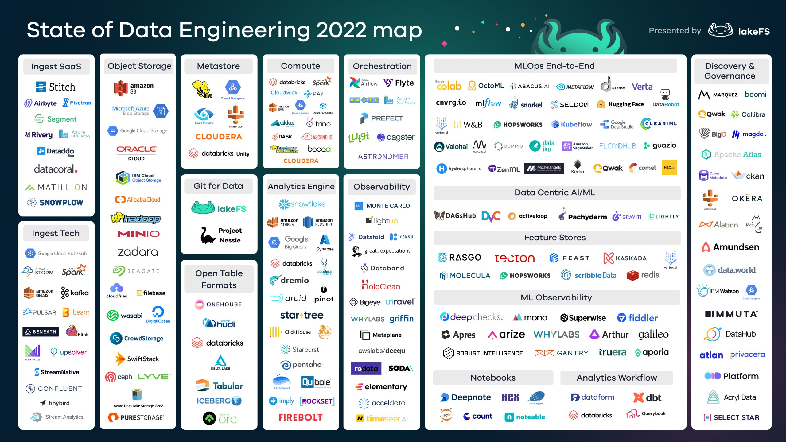
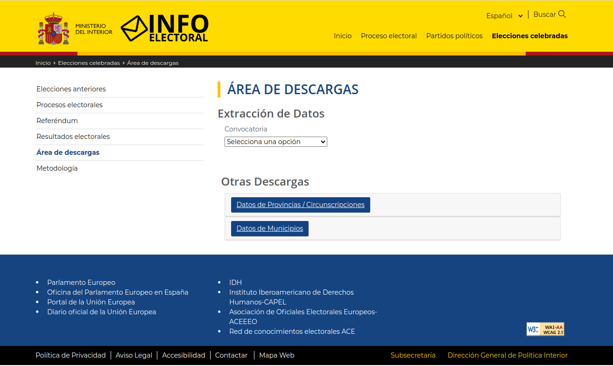
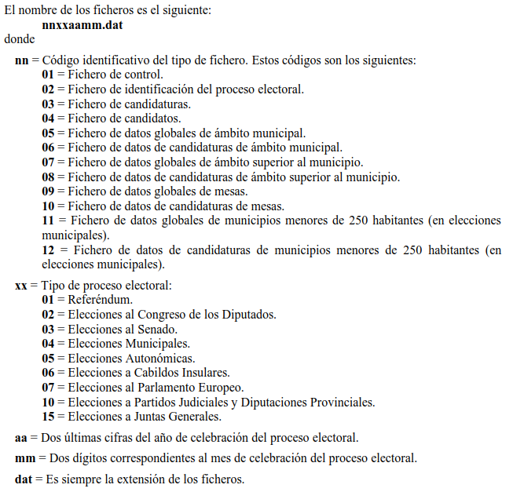

## ELT de Resultados Electorales con Stack Python

---

# License

The documentation of this project is licensed under the [CC-BY-SA-4.0](https://choosealicense.com/licenses/cc-by-sa-4.0/).

The underlying source code is licensed under the [GNU AGPLv3](https://choosealicense.com/licenses/agpl-3.0/).

Media could have their own trademarks and licenses.

---

fpuga

fpuga@icarto.es


---

# ?

???

-   A quién le suenan los orquestadores: Dagster, Prefect, Airflow, ...
    -   Quién ha usado alguno.
-   A quién le suena DBT.
    -   Quién lo ha usado.
-   Quién hace de vez en cuando procesado de datos: scrap de una web, mezclar un excel con un csv y subirlo a una bd, ...

---


???

-   No soy un experto en datos
-   No he usado Dagster, DBT ni Great Expectations antes.
-   Pero _proceso datos_ y dar una charla era una forma de empezar a usarlas
-   Esto va de mis casos de uso. No digo que esta forma de trabajar es la mejor, si no que a mi me va bien.

---

## ¿Por qué esta charla?

Del _one-liner_ al _big ball of mud_.

???

El germen de esta charla nació hace 10.

Un proyecto que empezó como un script en bash para subir un shp a una bd y acabó con bash, python, SQL empotrado en los ficheros, triggers, redirecciones a ficheros para hacer reportes y logging, ... y gestionando rásters, shapefiles, gpx, exceles variados, ...

La idea de la charla es presentar algunas tecnologías (Dagster, DBT y Great Expectations) para "procesar datos", sobre un ejemplo "divertido" (resultados electorales).

Esta charla no va de cómo se usan. En poco más de lo que dura la charla se puede leer la documentación que explica las cosas mejor que yo. Esta charla va de un caso de uso de _procesado de datos_ y como estás techs pueden ayudar.

--

## Que quiero solucionar metiendo tecnología

-   Logging
-   Scheduling
-   Caching (o más bien ejecuciones parciales)
-   Visualizar el WorkFlow o Documentación

--

## Otros requisitos

-   Lenguajes: Python, SQL y Bash
-   _Developer friendly_
-   _Opt in_
-   Conocimiento reutilizable

???

-   Lenguajes: Son los lenguajes que mejor conozco y son adecuados para los trabajos que yo hago.
    -   Pandas, Información Geográfica, PostgreSQL, ...
-   Developer friendly: Hay ¿decenas?, ¿cientos? de techs y formas de trabajar con datos. Uno de mis requisitos es que sean orientadas a devs y código.
-   Opt in. En mis proyectos a veces resulta difícil anticipar necesidades. Quiero algo a lo que no me tenga que acoplar mucho. Que me resulte fácil meterlo o sacarlo.
-   Conocimiento reutilizable. No me gusta meter tech por meter. Tiene un coste. La tech que uso, o el conocimiento que me genera me gusta que la pueda reusar. Dagster por ejemplo podría ser un substituto de Celery para mis casos de uso.

--

### Tecnologías de "data engineering"

<figure>
  
  <figcaption>https://lakefs.io/blog/the-state-of-data-engineering-2022/</figcaption>
</figure>

???

Docenas de términos algunos con sentido técnico y otros sólo comercial. No es objeto de esta charla entrar en detalles.

--

### Selección Tecnológica iCarto

Pendiente<!-- .element: style="color:red; text-align: center;" -->

--

## En esta charla

-   **Dagster**. Un orquestador enfocado a pipelines de datos. El workflow se escribe en Python, poco acoplamiento (o más bien gradual), buena UI/CLI, ...
-   **DBT**. Una herramienta de transformación basada en SQL. Está escrito en Python, y admite SQL con esteroides con templates de Jinja y un poco de magia
-   **Great Expectations**. QA. Asserts sobre datos escritos en Python. Si hay tiempo.
-   **Metabase**. BI. Gráficas, ... Si hay tiempo.

--

## ¿Por qué resultados electorales?

-   Por hacer algo práctico y no sólo teoría
-   Porqué es otro de mis side projects nunca acabados
-   Porqué tienen más chicha de la que parece. Nombres, DNIs, Secciones Censales, ...
-   Porqué siempre se ven visualizaciones, pero parece que la gente hace una y otra vez lo de conseguir los datos.

---

## Dominio - Web de descarga

<figure>
  
  <figcaption>https://infoelectoral.interior.gob.es/es/elecciones-celebradas/area-de-descargas/</figcaption>
</figure>

???

-   Cuando se trabaja con datos hay que conocer el "dominio".
-   El ministerio del interior tiene una página oficial de descargas de datos electorales. Pueden tardar varios meses en estar disponibles los resultados (resoluciones judiciales, ...)
-   En la web hay algunos datos estadísticos, diversas formas de descargar datos, ...
-   La "chicha" está en jugando con los combos de "convocatoria" y "fecha" descargar el zip con los resultados de mesa para cada elección.
-   Agrupando los resultados de mesa podemos generar cualquier otra información de la que se puede obtener de la web.

--

## Dominio - Nomenclatura .zip

-   `nnaaaamm_agg.zip`
    -   `nn`. Código del proceso (senado, congreso, ...)
    -   `aaaa`. Año
    -   `mm`. Mes
    -   `agg`. MESA | MUNI | TOTA
-   `02202307_MESA.zip`
    -   `02`. Congreso
    -   `2023`. Año
    -   `07`. Mes
    -   `MESA`. A nivel de mesa electoral

--

## Dominio - Nomenclatura .dat

<figure>
  
  <figcaption></figcaption>
</figure>

--

## Dominio - Ejemplo

https://infoelectoral.interior.gob.es/estaticos/docxl/apliextr/02202307_MESA.zip

```shell
02202307_MESA$ exa -T
.
├── 01022307.DAT
├── 02022307.DAT
├── 03022307.DAT
├── 04022307.DAT
├── 05022307.DAT
├── 06022307.DAT
├── 07022307.DAT
├── 08022307.DAT
├── 09022307.DAT
├── 10022307.DAT
├── FICHEROS.doc
└── FICHEROS.rtf
```

???

-   Cada zip tendrá un número de ficheros distintos en función del proceso
-   Los .dat son csv con registros de longitud fija y formato texto (con delimitador de registro CR+LF), usando el set de caracteres ANSI. Los distintos campos que componen cada registro tienen la siguiente estructura:
    -   Numéricos: ajustados a la derecha y completados con ceros por la izquierda.
    -   Alfanuméricos: ajustados a la izquierda y completados con blancos a la derecha.
-   Dos ficheros del mimo tipo `nn` tendrán siempre la misma estructura
-   Los archivos `FICHEROS.{doc,rtf}` tienen el mismo contenido y son una buena explicación del formato de los archivos

--

## Dominio - FICHEROS.DOC

[FICHEROS.DOC](./data/02202307_MESA/FICHEROS.doc)

--

## Dominio - Excepciones

-   Elecciones Municipales (incluye Partidos Judiciales y Diputaciones Provinciales)<!-- .element: style="font-size: 60%;" -->
    -   0304aamm.dat
    -   0404aamm.dat
    -   0504aamm.dat
    -   0604aamm.dat
    -   0704aamm.dat
    -   0804aamm.dat
    -   0904aamm.dat
    -   1004aamm.dat
    -   1104aamm.dat
    -   1204aamm.dat
    -   0510aamm.dat (Datos de Partidos Judiciales)
    -   0610aamm.dat (Datos de Partidos Judiciales)
    -   0710aamm.dat (Datos de Diputaciones Provinciales)
    -   0810aamm.dat (Datos de Diputaciones Provinciales)

???

Las elecciones municipales incluyen partidos judiciales y diputaciones. La nomenclatura varía.

--

## Dominio - Excepciones

| DAT | INE | CA                   |
| --- | --- | -------------------- |
| 01  | 01  | Andalucía            |
| 02  | 02  | Aragón               |
| 03  | 03  | Asturias             |
| 04  | 04  | Baleares             |
| 05  | 05  | Canarias             |
| 06  | 06  | Cantabria            |
| 07  | 08  | Castilla - La Mancha |
| 08  | 07  | Castilla y León      |
| 09  | 09  | Cataluña             |
| 10  | 11  | Extremadura          |
| 11  | 12  | Galicia              |
| 12  | 13  | Madrid               |
| 13  | 15  | Navarra              |
| 14  | 16  | País Vasco           |
| 15  | 14  | Región de Murcia     |
| 16  | 17  | La Rioja             |
| 17  | 10  | Comunidad Valenciana |
| 18  | 18  | Ceuta                |
| 19  | 19  | Melilla              |

<!-- .element.table: style="font-size:40%;" -->

???

-   Los códigos de comunidades autónomas no siguen la nomenclatura del INE
-   Los resultados de las elecciones autonómicas no son gestionados por el estado

--

## Dominio - \*.DAT

-   Fichero de CONTROL: [01022307.DAT](./data/02202307_MESA/01022307.DAT)
-   Fichero de CANDIDATURAS: [03022307.DAT](./data/02202307_MESA/03022307.DAT)
-   Fichero de CANDIDATOS: [04022307.DAT](./data/02202307_MESA/04022307.DAT)

???

-   Revisar el contenido de los ficheros .dat en ./data/02202307_MESA

---

## Explorar los datos

1. Abrir las dev tools. Abrir la hoja de cálculo.
2. Documentar: _screenshots_, _snapshots_, enlaces, ...
3. Abrir un notebook de Jupyter.
4. Escribir código _malo_. Iterativo. Exploratorio.
5. Descubrir problemas, ie: injectar cookie
6. Anotar errores, ie: datos no siguen nomenclatura.
7. Obtener resultados: _characterization / golden test_.
8. Sacar el código de Jupyter a Producción.
    - Refactorizar.
    - Funciones pequeñas: No sé como las voy a usar todavía.
    - Funciones agregadoras.

???

-   Mi flujo en estos trabajos, sea scrapear una web o procesar exceles.
-   Aquí toca abrir un Jupyter y mostrar un ejemplo de flujo. Por ejemplo con "tipos de convocatorias", hablando del tema del basic auth, el screenshot al js, ...
-   Pero no entrar en el código final, eso va para la siguiente transparencia.

---

# Show me the code

--

-   `main.py` -> `obtener_listados()` -> `_extract()`
    -   ¿`run_checks()`?
    -   ¿filtrado?

<div style="text-align: left;">

El flujo es díficil de seguir. Hay que bucear el código, ...

Pero... no molaba tener unas cajitas que me dijeran por donde pasa el proceso o tocar para cambiar algo.

</div>

???

-   Es verdad que run_checks y filtrado quizás deberían subir al primer nivel.

--

-   `myconfig.py`

No molaba no liarnos con configuración (_secrets_, ...) e inicialización (crear directorios, crear schemas, ...)

--

```python
def obtener_listado():
    ...
    with (DATA_FOLDER / "listado.json").open("w") as f:
        json.dump(result, f)


def listado_a_postgres():
    with (DATA_FOLDER / "listado.json").open() as f:
        data = json.load(f)
    ...
```

Cómo pasamos datos:

-   objetos del lenguaje: No permite ejecutar una _fase_ por separado
-   ficheros en disco: rutas, prod vs dev, ...
-   bd: ¿están los datos disponibles en la bd en todos los puntos?

Todo solucionable. Pero... no molaba _algo_ que nos ayudase.

--

```python
print(df)

display(extract_listado_convocatorias_por_tipo(Convocatoria(tipo="2")))
```

Pero... no molaba tener una preview de los datos sin _contaminar_ el código o saltar a Jupyter. Y que tal logging sencillo.

---

## Dagster

???

-   Dagster es un orquestador centrado en procesado de datos (_data pipelines_) donde el flujo se define mediante código Python puro.
-   Cumple los requisitos que vimos muchas transparencias atrás y ayuda con los _no molaba_ de las últimas.
-   Se puede instalar con `pip install dagster`
-   Viene con varias plantillas que predefinen una estructura de directorios para arrancar pero es muy flexible
-   Se puede integrar con un montón de herramientas.
-   Cuidado: No es lo mismo basarse en Dagster y meter DBT, que basarse en DBT y meter Dagster.

---

-   ¿No molaba tener unas cajitas que me dijeran por donde pasa el proceso? (s2)
-   No molaba tener una preview de los datos sin saltar a Jupyter. Y logging.(s3)
-   No molaba _algo_ que nos ayudase con la persistencia y pasar datos entre procesos. (s4)
-   No molaba no liarnos con configuración (_secrets_, ...) e inicialización (crear directorios, crear schemas, ...) (**pendiente**)

---

## DBT

???

DBT es la T por defecto de de ELT. Asume que hay una forma de extraer y cargar los datos en un datawarehouse y las transformaciones se hacen directamente sobre el datawarehouse.

En modo librería DBT es un SQL con esteroides.

---
